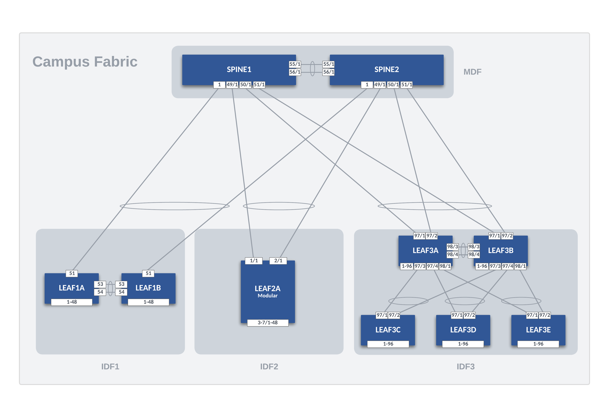

# Arista Cloud Builders EMEA 2024 - Hybrid Campus Provisioning Demo

This repository provides a [containerlab](https://containerlab.dev/) topology file, a [cEOS startup configuration](./configs/ceos-startup.cfg), [cEOS interface mapping files](./configs/eos-intf-mapping/) and [Netplan configuration](./configs/linux/) to implement the following Campus Fabric:

The [avd](./avd/) folder contains an Arista Validated Design project to deploy the Day-1 confoguration of this fabric. It is based and uses the same design as the [AVD Campus Fabric Example](https://avd.arista.com/4.10/examples/campus-fabric/index.html).

The Day-2 configuration is then managed by CloudVision Access Interface Configuration Studio and the Quick Action can be used.

## Usage

- Install [AVD](https://avd.arista.com/4.10/docs/installation/collection-installation.html).
- Install [containerlab](https://containerlab.dev/).
- Make sure the [ceos-startup](./configs/ceos-startup.cfg) TerminAttr confguration points to your CloudVision instance.
- Update [inventory.yml](./avd/inventory.yml) file with your CloudVision user and token.
- Generate a CloudVision token for device onboarding and create a file `cv-onboarding-token` at the root of this repository.
- Make sure to use a fixed System MAC in configs under [ceos-config](configs/ceos-config). This can be updated after the first deployment.
- Use `make -C server` to build the Ubuntu Docker image used as endpoint.
- Use `make start` to start the topology.
- Use `make build` to create the Day-1 Configuration with AVD.
- Use `make deploy` to deploy the Day-1 configuration using CloudVision. A Studio workspace will be submitted, a change control created and waiting execution.

Refer to the [Makefile](./Makefile) for all commands.

## Day-2 Configuration with CloudVision

After having deployed the Day-1 Configuration, the CloudVision Access Interface Configuration Studio can be used to deploy the Access Port configuration.

Create the port profiles to be used in the Quick Action. Endpoints expect ports in switchport access mode. Refer to the [AVD Network Services](./avd/group_vars/NETWORK_SERVICES.yml) for the VLAN number to use. Refer to the [topology file](./topology.clab.yml) for endpoints physical attachments. Ubuntu has LLDP enabled.

## Open Traffic Generator

You can generate traffic using [ixia-c](https://ixia-c.dev/). The [otg.yml](./otg.yml) file provides an example of unicast voice traffic being generated.

- Install [otgen](https://otg.dev/clients/otgen/#installation) CLI tool
- Use `make flows` to send the traffic

## ANTA

There is an ANTA [inventory](./avd/anta-inventory.yml) and [test catalog](./avd/anta-catalog.yml) ready to use for this topology.
The test catalog has been created from the [catalogs generated by AVD](./avd/intended/test_catalogs/) and [this script](https://anta.arista.com/stable/usage-inventory-catalog/#example-script-to-merge-catalogs).

- Install the [ANTA CLI](https://anta.arista.com/stable/requirements-and-installation/#install-anta-cli-as-an-application-with-pipx)
- Use the command `anta nrfu -u admin -p admin -i avd/anta-inventory.yml -c avd/anta-catalog.yml`